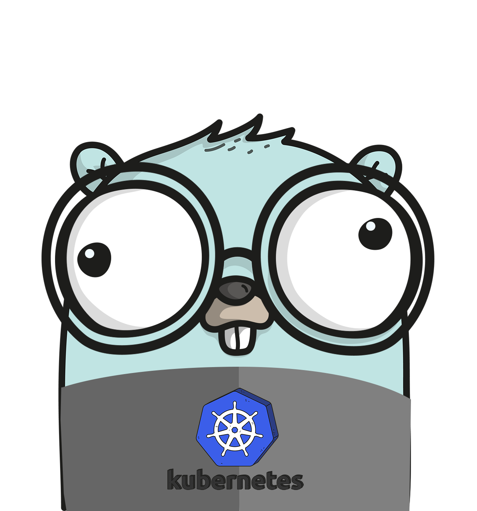

# salehctl
Implement the minimal kubectl to get better understanding of kubectl and kubernetes api server


<p align="center">

</p>


## Up and Running
```bash
go build
./salehctl apply -f config-example.yml
```
